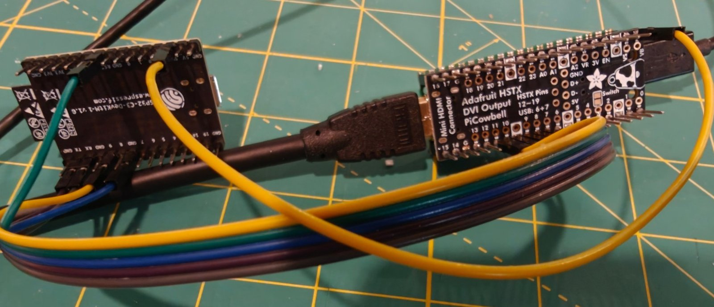
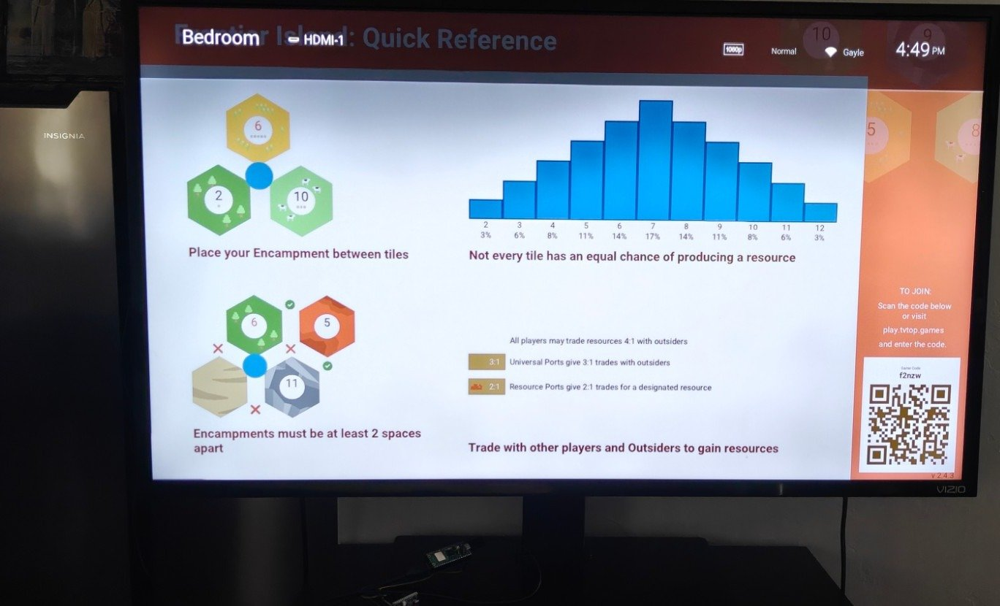

# Hardware notes

## Wiring

*The breakout this was developed on, with its pin assignment printed on it: HSTX pins 12-19, USB on 6+7.*

Four differential pairs on GPIO12-19. libdvi's `pico_sock_cfg` is exactly this pinout, so
`board.h` uses it unchanged and any Pico DVI breakout that follows it will work: an HSTX to DVI
adapter, a Pico DVI Sock, a plain HDMI breakout, or soldered wires. On the RP2350 these are the
HSTX pins; on an RP2040 the same GPIOs are driven by PIO (PicoDVI). Development was done on an
Adafruit PiCowBell HSTX DVI (product 6363), which is only what happened to be in stock.

| Signal | GPIO | libdvi lane |
|---|---|---|
| D0+ / D0− (blue) | 12 / 13 | `pins_tmds[0]` = 12 |
| D1+ / D1− (green) | 18 / 19 | `pins_tmds[1]` = 18 |
| D2+ / D2− (red) | 16 / 17 | `pins_tmds[2]` = 16 |
| CK+ / CK− | 14 / 15 | `pins_clk` = 14 (PWM slice 7) |

The positive line of every pair is the lower GPIO, so `invert_diffpairs` is false.

### The production board (TV-Top Kiosk v2)

The custom board in `../TV-Top Kiosk/v2` is this same circuit without the development boards: an
RP2350A, a Raspberry Pi Radio Module 2 on the Pico 2 W's radio GPIOs (23/24/25/29, LED on the
radio's GPIO0), an HDMI-A plug (not a socket: the stick goes straight into the TV) on GPIO12-19 in
the PiCowBell's pair order, DDC on GPIO4/5 and hot-plug on GPIO11. Electrically it is a Pico 2 W plus PiCowBell, so it runs the `pico2_w` build unchanged.
It has no BOOTSEL button: a blank chip enumerates as a USB drive on its own, `picotool load -f`
reboots a running kiosk into that mode, and the `BOOT` solder pads on the back force it.

## Why 372 MHz at 1.30 V

The PIO serialiser shifts one TMDS bit per system-clock cycle, so the system clock *is* the TMDS
bit clock: 10 × pixel clock. 1280×720 needs 37.2 MHz of pixels at 30 Hz, hence 372 MHz. That is
~2.8× the RP2040's rated 133 MHz; PicoDVI's author measured a clean eye at 372 Mbit/s with the
core regulator raised, and 1.25–1.30 V is what the community runs 720p30 at. We use 1.30 V (the
regulator's ceiling without unlocking). Expect the chip to run warm; it does not need a heatsink.

Flash is clocked at clk_sys/4 = 93 MHz (`PICO_FLASH_SPI_CLKDIV=4`, set for the boot stage 2 in
`CMakeLists.txt`) because the Pico W's W25Q16 is rated for 133 MHz and the default divider of 2
would run it at 186 MHz. The cyw43 Wi-Fi PIO divider is recomputed from the actual clock in
`net_wifi.c` so the PIO still runs at the stock ≈62.5 MHz (the SDK's SPI program samples for that
rate; halving it stopped the chip from starting at all).

## Wi-Fi and the DVI clock

The TMDS clock lane is a clean square wave at the pixel clock, so it radiates a comb of harmonics
every ~37 MHz, and the PiCowBell sits directly under the Pico W's antenna. At 960x540 on 372 MHz the
65th harmonic is 2418 MHz, inside Wi-Fi channel 1. Signal strength stays good (about −40 dBm), but
under traffic the radio stops granting transmit credits: the console shows
`[CYW43] STALL(0;n-n): timeout` and `send_ethernet failed: -2`, polls time out, and only a reset
recovers. Silencing the DVI pins (`tmds off`) cures it; so does moving the clock.

So the 960x540p60 and 1066x600p50 clocks follow the channel (1066x600 has its own table, limited to clocks that keep 30.5 kHz and 49 Hz). `video_mode_clock_khz` in `board.c` holds, for each
2.4 GHz channel, the exact PLL frequency between 56 and 62 Hz refresh (at or below the validated
372 MHz where possible) whose nearest harmonic is furthest from the channel centre. Every entry
clears it by at least 14 MHz; 372 MHz itself clears channel 1 by only 6 MHz.

| Channel | 1 | 2 | 3 | 4 | 5 | 6 | 7 | 8 | 9 | 10 | 11 | 12 | 13 | 14 |
|---|---|---|---|---|---|---|---|---|---|---|---|---|---|---|
| clk_sys (MHz) | 368 | 369 | 364 | 354 | 366 | 372 | 351 | 368 | 369 | 364 | 354 | 360 | 372 | 368 |

The clock is set before Wi-Fi starts, so the kiosk stores the channel it joined in the config
sector. When the access point is on a channel whose clock differs from the one running, it saves the
channel and reboots once (`wifi: channel 1; moving the video clock from 372000 to 368000 kHz`). A
watchdog scratch register limits that to two reboots in a row, so an access point that changes
channel on every join cannot reboot-loop the kiosk. Other modes keep their fixed clocks.

Measured on the M32U bench (channel 1, a live board every eight seconds): 372 MHz stalled within a
minute or two of every boot; 368 MHz ran with no stalls, no resets and no red lines.

### The 720p30 timing is not the CEA 720p30

CEA-861 720p30 keeps the 74.25 MHz pixel clock and doubles the horizontal blanking, which would
need a 742 MHz system clock. PicoDVI's mode is the 720p60 raster (1650×750) at half the pixel
clock: 22.5 kHz horizontal, 30.06 Hz vertical. Most TVs and monitors lock to it, some refuse. The
signal is otherwise a normal 1280×720 DVI stream.

## Pico 2 W (RP2350): HSTX

GPIO12-19 are the RP2350's HSTX pins, so on a Pico 2 W the DVI signal comes
from HSTX, a hardware serialiser with a built-in TMDS encoder, instead of PIO. Pairs as on the Pico
W: D0 GPIO12/13, CK 14/15, D2 16/17, D1 18/19.

| Mode | Output | clk_sys | clk_hstx | Pixel clock | Vreg |
|---|---|---|---|---|---|
| `720p60` (default) | 1280×720, CEA VIC 4, 45 kHz / 60.12 Hz | 372 MHz (369-375 by Wi-Fi channel) | clk_sys | 74.4 MHz | 1.30 V |
| `960x540p60` | 960×540 | 351-372 MHz by channel | clk_sys / 2 | 37.2 MHz | 1.30 V |
| `480p60` | 640×480 | 252 MHz | clk_sys / 2 | 25.2 MHz | 1.20 V |
| `1080p30` | 1920×1080, CEA VIC 34, 33.8 kHz / 30.06 Hz | as 720p60 | clk_sys | 74.4 MHz | 1.30 V |
| `1080p25` | 1920×1080, CEA VIC 33, 28.2 kHz / 25.05 Hz | as 720p60 | clk_sys | 74.4 MHz | 1.30 V |
| `1080p24` | 1920×1080, CEA VIC 32, 27.1 kHz / 24.05 Hz | as 720p60 | clk_sys | 74.4 MHz | 1.30 V |

*The sink's own report of what it is being sent, in the 1080p30 mode below.*

- **1080p.** DVI sends ten bits per pixel per lane whatever the colour depth, so the link rate is set
  by the pixel clock alone. 1080p60 needs 148.5 MHz, twice what HSTX manages, but 1080p at 24-30 Hz
  has 720p60's 74.25 MHz pixel clock and costs nothing on the link. The kiosk redraws only when the
  game changes, so the refresh rate is invisible. 1080p30 is inside a 30 kHz monitor (the M32U
  accepts it); 24 and 25 Hz are for TVs, whose line rates fall under 30 kHz. A 1080p board needs
  about twice the scanline memory of 720p (Frontier Island: 192 KB of the 256 KB pool) and the
  line builder has 29.6 µs per line at 30 Hz, 37 µs at 24 Hz.

- **Bit rate.** One pixel is ten TMDS bits, two per HSTX clock cycle, so 720p60 needs 744 Mbit/s.
  That is past the HSTX's rated 300 Mbit/s per pin; PicoHDMI runs the same 372 MHz, 1.30 V setting as
  an experimental mode. Pads are 12 mA with fast slew. If a chip or cable lacks the margin, use
  `mode 960x540p60`.
- **Colour.** The hardware encoder takes any 8-bit value per channel, so palette colours are exact
  (`KIOSK_FULL_COLOUR`): no DC-balanced rounding and no near-white collisions.
- **Lines.** Each scanline is an HSTX command stream built from the line pool's runs
  (`src/pico/hstx_line.c`): a run of any length is two words (TMDS_REPEAT and a colour). Core 1
  builds six lines ahead of the beam; a DMA interrupt, also on core 1, posts them. A line not ready
  in time is sent black and counted as a red (missed) line in `stats`.
- **Flash at 372 MHz.** The RP2350 has no boot stage 2 to slow the flash clock, and at 372 MHz the
  boot divisor would clock the flash near 190 MHz, which corrupts XIP reads. Before the system clock
  goes up, `scanout_hstx.c` raises the QMI divisor to keep the flash at or below 100 MHz (CLKDIV 4,
  RXDELAY 2 at 372 MHz) and reapplies it after every flash erase or program.
- **The geometry cache is per resolution.** A board's map is cached in flash in device pixels, so
  a set decoded at 720p is wrong at 1080p. The cache header records the resolution it was decoded
  for, and after a mode change the kiosk fetches the map again rather than opening the old set.
- **Core 1 never reads flash.** It builds lines while core 0 may be erasing the geometry cache, when
  flash is unreadable; even the mode table (const data) is copied to RAM for it.
- **Wi-Fi.** The same harmonic interference applies. 720p60's clock is chosen per channel from exact
  PLL frequencies between 369 and 375 MHz (59.6-60.6 Hz), clearing each channel by at least 16 MHz.

## Modes

| Name | Output | clk_sys | Vreg | Notes |
|---|---|---|---|---|
| `720p30` (default) | 1280×720 | 372 MHz | 1.30 V | full canvas resolution |
| `720p30rb` | 1280×720 | 319.2 MHz | 1.25 V | CVT reduced blanking; gentler overclock, fewer sinks accept it |
| `480p60` | 640×480 | 252 MHz | 1.20 V | VGA timing; most PC monitors accept it, but HDMI-only panels that do not list it in their EDID will not |
| `960x540p60` | 960×540 | 351–372 MHz by Wi-Fi channel | 1.30 V | qHD, 33.7 kHz / 60 Hz: the sharpest mode for monitors that need ≥ 30 kHz (720p30 is 22 kHz); a whole-number scale to 1080p and 4K; not a CEA mode, so the sink must accept in-range timings |
| `1066x600p50` | 1066×600 | 363–378 MHz by Wi-Fi channel | 1.30 V | 5/6 of 720p at 31 kHz / 50 Hz with trimmed blanking: the sharpest mode inside a 30 kHz / 48 Hz monitor such as the M32U; 23% more pixels than qHD, but not a whole-number scale to 4K |
| `720x480p60` | 720×480 | 270 MHz | 1.20 V | CEA-861 480p (VIC 2/3); the mode small HDMI panels and most TVs do list; the 16:9 canvas is letterboxed |

Select with the USB console (`mode 720p30rb`, then reboot) or at build time
(`-DKIOSK_VIDEO_MODE=480p60`). The setting persists in the config sector.

## No picture?

1. Check what the display accepts: `tools/pin-test` reads its EDID over the DDC lines
   (GPIO4 SDA, GPIO5 SCL) and prints every mode it lists. Needs those two wired; video does not. A mode missing from that list will show "no signal".
2. Try `mode 480p60` or `mode 720x480p60`. If that shows the test pattern (`test` on the console) the TMDS path is
   fine and the TV rejected the 720p30 timing or the board could not reach 372 MHz.
3. Try `mode 720p30rb`: a 14% lower overclock.
4. Check `stats`: the red (missed) and dropped late line counts must stay 0. A non-zero count means
   core 1 could not expand a line in time; the worst-line cycles say how close it got.
5. Long or poor HDMI cables matter at 372 Mbit/s from 3.3 V CMOS pins. Use a short cable.

## Picture fine, but the kiosk keeps going offline?

Run `stats` and look for `[CYW43] STALL` in the console. If the channel's clock is not the one in
the table above (a fixed-clock mode, or the retune limit was hit), try `tmds off` for a few minutes:
if the stalls stop, it is DVI interference. `tmds on` restores the picture.

## Scanline budget (720p30)

A line is 1650 pixels / 37.2 MHz = 44.4 µs = 16,500 cycles. The run-length encoder writes
1,920 words per line: about 1.3 cycles per word for long runs (unrolled store loop, one lane at a
time) plus a fixed cost per span. `stats` reports the worst line seen since the last query.
